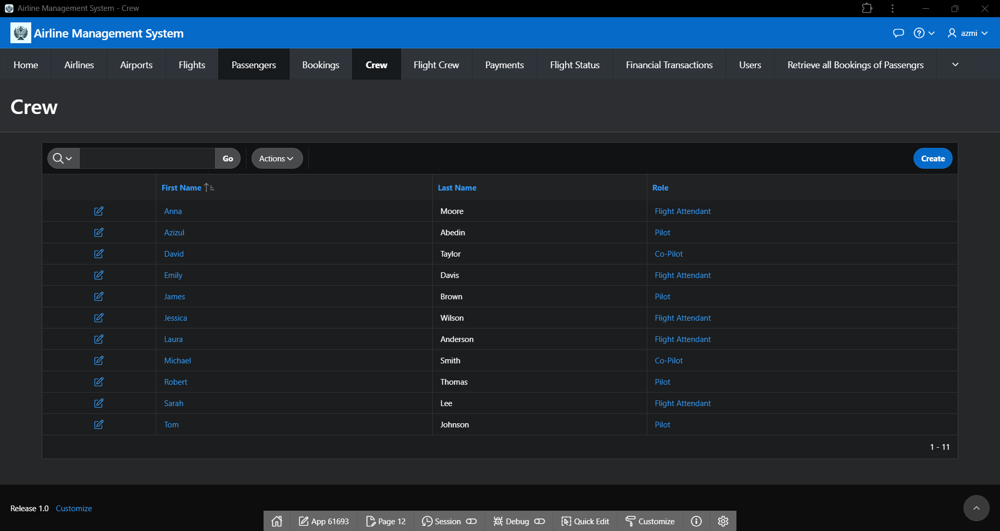
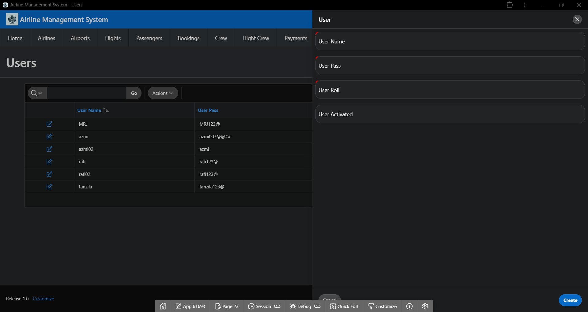
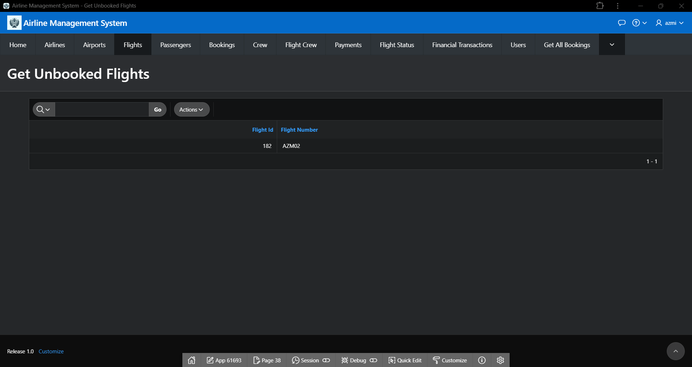

# CSE302-ORACLE-APEX-Projects
CSE302-ORACLE-APEX-Projects : Airline Management System

**Project Report**

Airline Management System

Project URL: 
https://apex.oracle.com/pls/apex/r/azmi/airline_management_system/login?session=100208179961928

**Team Members:** 

|**Contributors** |**Student Name** |**Contribution Percentage** |
| - | - | - |
|**1** |**[Azizul Abedin Azmi](https://github.com/azizulabedinazmi)** |**40%** |
|**2** |**[Tanzila Afrin](https://github.com/Tanzila-Afrin)** |**30%** |
|**3** |**Nur Uddin Bhuiyan Rafi** |**30%** |

1. E-R Model of the Project

2. Schema Design of the Project

3. Implementation Checklist

|**Description** |**Remarks** |
| - | - |
|Authentication Type** |Custom |
|Number of Reports with Forms** |11 |
|Number of Reports based on Queries, Aggregate Queries** |6 |
|Included any trigger/other feature which is not taught in class. If yes, please explain briefly.** |Yes, we use trigger which automatically assigns a new value to the (primary key) column to sequence before a new row is inserted into the triggered table. |
|Write the most unique feature/functionality in your application or the page of your application that you are proud of. Explain briefly.** |One unique feature of our application is the Automated Flight Crew Assignment System, which dynamically assigns crew members to flights based on roles, availability, and compliance with regulations. This feature reduces manual scheduling efforts and ensures efficient crew management. |

4. Reports with Forms

|Report Page Number and Name |Form Page Number and Name |Table |
| - | - | - |
|2-Airlines |3-Airline |Airlines |
|4-Airports |5-Airport |Airports |
|6-Flights |7-Flight |Flights |
|8-Passengers |9-Passenger |Passengers |
|10-Bookings |11-Booking |Bookings |
|12-Crews |13-Crew |Crews |
|14-Flight Crews |15-Flight Crew |Flight\_Crews |
|16-Payments |17-Payment |Payments |
|18-Flights Status |19-Flight Status |Flight\_Status |
|20-Financial Transactions |21- Financial Transaction |Financial\_Transactions |
|22-Users |23-User |Users |

**Screenshots:**

Figure 1.1 Airlines Report Page.

Figure 1.2 Airline Form Page.

Figure 2.1 Airports Report Page.

Figure 2.2 Airport Form Page.

Figure 3.1 Flights Report Page.

Figure 3.2 Flight Form Page.

Figure 4.1 Passengers Report Page.

Figure 4.2 Passenger Form Page.

Figure 5.1 Bookings Report Page.

Figure 5.2 Booking Form Page.

Figure 6.1 Crews Report Page.

Figure 6.2 Crew Form Page.

Figure 7.1 Flight Crews Report Page.

Figure 7.2 Flight Crew Form Page.

Figure 8.1 Payments Report Page.

Figure 8.2 Payment Form Page.

Figure 9.1 Flights Status Report Page.

Figure 9.2 Flight Status Form Page.

Figure 10.1 Financial Transactions Report Page.

Figure 10.2 Financial Transaction Form Page.

Figure 11.1 Users Report Page.

Figure 11.2 User Form Page.

5. Reports based on Multi-Table and Aggregate Queries

|Page Number and Name |Query Type |Report description |
| - | - | - |
|26-Get All Bookings |Nested |Retrieve all bookings along with passenger names |
|28-Airline With Flight |Nested |Retrieve all airlines that have flights |
|36-Ger Departure Airports |Nested |Find all airports that have flights departing from them |
|38-Get Unbooked Flights |Nested |Find all flights that do not have any bookings |
|44- Get High-Value Passengers |Nested |List all passengers who have booked a flight with a price greater than $1000 |
|48-Get Unassigned Crew |Nested |List all crew members who are not assigned to any flight |

**Screenshots:**

Figure 12 Get All Bookings Report Page

Figure 13 Airline with Flight Report Page

Figure 14 Get Departure Airports Report Page

Figure 15 Get Unbooked Flights Report Page

Figure 16 Get High-Value Passengers Report Page

Figure 17 Get Unassigned Crew Report Page

6. Authorization and User Role Assignment

**User Role Assignment:**

-- user\_activated column: 1 means active, 0 means inactive

|User name |Password |Role |User Activated |
| - | - | - | - |
|azmi |azmi007@@## |admin |1 |

7. Concluding Remarks

Developing with Oracle APEX was a mix of frustration and satisfaction. The platform made simple tasks easy but felt limiting for complex customizations. Despite some challenges, the quick deployment and ease of use made it worthwhile. 
Page 19

# Oracle APEX Application Installation Guide

## Steps to Install the Application

### 1. Import the ZIP File (Frontend of the Application)
- Navigate to the **App Builder** in Oracle APEX.
- Click on **Import**.
- Choose the ZIP `azmi_project.zip` file containing the frontend of the application.
- Follow the instructions to complete the import process.

### 2. Upload and Run the .SQL File (Backend of the Application)
- Navigate to the **SQL Workshop** in Oracle APEX.
- Select **SQL Scripts** and then **Upload**.
- Upload the `project.sql` file which contains the backend logic (database schema, procedures, etc.).
- After uploading, run the script to configure the database backend.

### 3. Default Login Credentials
- **Username:** `azmi`
- **Password:** `azmi007@@##`

Once these steps are completed, you should be able to log in using the default credentials.
